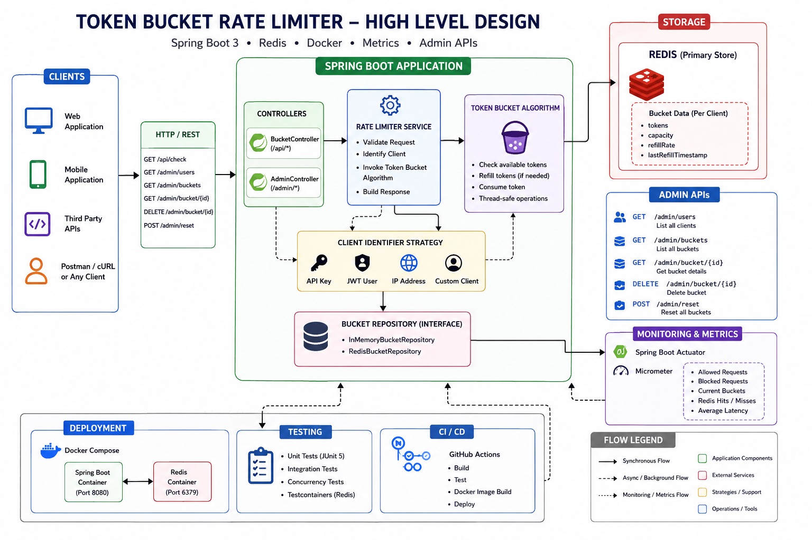

# 🚀 Token Bucket Rate Limiter

[](https://github.com/dineshdhayfule/Token-Bucket-Rate-Limiter/actions/workflows/ci.yml)


🌐 **Live Demo:** https://token-bucket-rate-limiter-jade.vercel.app/

A production-oriented **Token Bucket Rate Limiter** built with **Java 21**, **Spring Boot 3**, **Redis**, **Docker**, and a **React + Vite Admin Dashboard**.

This project demonstrates how distributed rate limiting is implemented in production systems using Redis-backed token buckets, thread-safe concurrency control, monitoring, testing, and CI/CD.

---

# ✨ Features

- ✅ Token Bucket Rate Limiting Algorithm
- ✅ Redis-backed Distributed Storage
- ✅ In-Memory Storage
- ✅ Thread-safe using `ReentrantLock`
- ✅ Multiple Client Identification
  - API Key
  - JWT
  - IP Address
  - User
- ✅ Admin Dashboard (React + Vite)
- ✅ Bucket Management APIs
- ✅ Metrics with Spring Boot Actuator & Micrometer
- ✅ Docker & Docker Compose
- ✅ Comprehensive Testing
- ✅ GitHub Actions CI/CD

---

# 🎯 Why this project?

Many tutorials implement rate limiting using a simple `HashMap`, which only works for a single application instance.

This project demonstrates a more production-oriented approach by using:

- Redis as centralized bucket storage
- Thread-safe token consumption
- Configurable refill strategy
- Multiple client identification methods
- RESTful APIs
- Monitoring & Metrics
- Dockerized deployment
- Automated CI/CD

---

# 🏗️ Architecture



### Request Flow

```text
                +----------------------+
                |   React Dashboard    |
                +----------+-----------+
                           |
                           v
                +----------------------+
                | Spring Boot REST API |
                +----------+-----------+
                           |
                           v
                +----------------------+
                | Token Bucket Engine  |
                +----------+-----------+
                           |
                           v
                +----------------------+
                |        Redis         |
                +----------------------+
```

---

# 🛠️ Tech Stack

| Category | Technologies |
|-----------|--------------|
| Backend | Java 21, Spring Boot 3 |
| Frontend | React 19, TypeScript, Vite, Tailwind CSS |
| Storage | Redis |
| Testing | JUnit 5, Mockito, Testcontainers |
| Monitoring | Spring Boot Actuator, Micrometer |
| DevOps | Docker, Docker Compose, GitHub Actions |

---

# 🚀 Quick Start

## Clone the Repository

```bash
git clone https://github.com/dineshdhayfule/Token-Bucket-Rate-Limiter.git

cd Token-Bucket-Rate-Limiter
```

## Run with Docker

```bash
docker compose up --build
```

Backend

```
http://localhost:8080
```

Frontend

```
http://localhost:5173
```

Stop containers

```bash
docker compose down
```

---

# 📡 API Example

### Check Rate Limit

```http
GET /api/check?type=USER&id=dinesh
```

Response

```json
{
  "allowed": true,
  "tokensRemaining": 19
}
```

---

## Admin APIs

| Method | Endpoint |
|---------|----------|
| GET | `/admin/users` |
| GET | `/admin/buckets` |
| GET | `/admin/bucket` |
| DELETE | `/admin/bucket` |
| POST | `/admin/reset` |

---

# 📊 Monitoring

The application exposes production-ready metrics using **Spring Boot Actuator** and **Micrometer**.

Available endpoints:

- `/actuator/health`
- `/actuator/info`
- `/actuator/metrics`
- `/actuator/prometheus`

---

# 🧪 Testing

Run all tests

```bash
./mvnw test
```

Current Status

```
Tests Run : 48
Failures  : 0
Errors    : 0
```

Test Coverage includes:

- Unit Tests
- Service Tests
- Repository Tests
- Controller Tests
- Concurrency Tests

### Concurrency Validation

```text
1000 Concurrent Requests

↓

100 Allowed

900 Blocked
```

Verifies:

- Thread Safety
- Correct Token Consumption
- No Race Conditions
- No Negative Token Counts

---

# ⚙️ Configuration

| Variable | Default |
|-----------|---------|
| REDIS_HOST | localhost |
| REDIS_PORT | 6379 |
| RATE_LIMITER_CAPACITY | 20 |
| RATE_LIMITER_REFILL_RATE | 5 |

---

# 🗺️ Roadmap

- ✅ In-Memory Rate Limiter
- ✅ Redis Integration
- ✅ Multiple Client Strategies
- ✅ Admin APIs
- ✅ Metrics & Monitoring
- ✅ Docker Support
- ✅ Testing
- ✅ GitHub Actions
- ✅ React Admin Dashboard
- ✅ Deployment

---

# 📚 Engineering Concepts

- Token Bucket Algorithm
- Distributed Rate Limiting
- Thread Safety
- ReentrantLock
- ConcurrentHashMap
- Redis
- Layered Architecture
- Repository Pattern
- REST APIs
- Docker
- CI/CD
- Monitoring
- Integration Testing

---

# 👨‍💻 Author

**Dinesh Dhayfule**

- GitHub: https://github.com/dineshdhayfule
- LinkedIn: https://linkedin.com/in/dinesh-dhayfule

---

## ⭐ If you found this project useful, consider giving it a star!